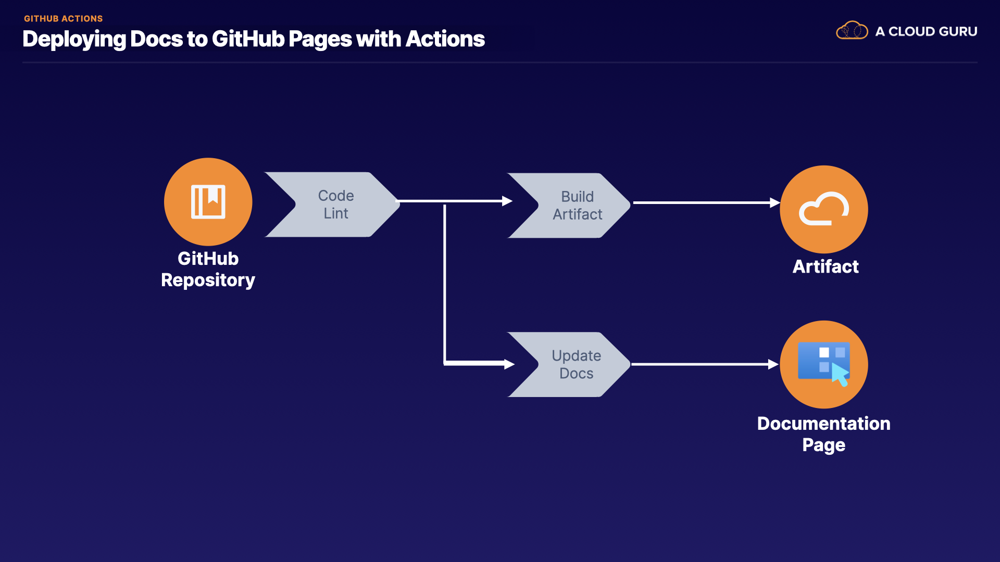

# Deploy Docs to GitHub Pages with Actions




### ABOUT THIS LAB
Your company has developed a mobile application. The GitHub README has developer notes, but users report they are not helpful for troubleshooting common user issues. Marketing has worked with the Engineering team to create a user guide Markdown document. This will be updated with every release. You need to develop a GitHub Actions workflow to deploy this user guide to GitHub Pages so users can access the latest user guide with each release.

### LEARNING OBJECTIVES
- Set Up Documentation to Deploy as Part of the Workflow
- Set Up a Trigger Condition for the Workflow


<br><br><br>


## Solution

Open the GitHub repository using the link provided in the lab resources.

If you don't already have a personal GitHub account, create one before you start the lab by signing up at github.com.

## Set Up Documentation to Deploy as Part of the Workflow
### Fork the GitHub Repository
1. Click `Fork` in the upper right corner, then select your personal GitHub account to fork the repo into your own account.
2. Click `Actions` in the top menu bar and note there are currently no workflows running on the forked repo.
3. Select `View the workflows directory`. There is currently only an `init.yaml` file in the directory.
4. Go back to `Actions`, then click `I understand workflows, go ahead and enable them`.
5. Click `Code` in the top menu bar to review your code.
6. Use the branch dropdown on the left to select the lab branch. Ensure you remain on the lab branch for the rest of the lab.
7. Open the `userguide.md` file. The file contains some basic text, which you want to share with users.
8. Go back to the main page of the lab branch and open the **function** directory. This is where your Python application file lives.
9. Go back to the main page of the lab branch again and open the `github/workflows` directory.
10. Open the `deploy-pipeline.yaml` file. This is a starter pipeline that contains a lint and a build step.


<br>


### Add a Documentation Job to the GitHub Workflow
1. From `deploy-pipeline.yaml`, click the pencil icon on the right to edit the file in the browser. You could also clone the repo and work locally.
2. Scroll to the bottom of the workflow and add a few spaces.
3. Add a new documentation job below the existing workflow:
    ```yaml
    documentation:
        runs-on: ubuntu-latest
        needs: lint
        steps:
        - name: Checkout code
            uses: actions/checkout@v2
        - name: Create docs folder
            run: mkdir docs
        - name: Convert md to html
            uses: docker://pandoc/core:2.9
            with:
            args: userguide.md -t html -o docs/index.html
        - name: Deploy Pages site
            uses: JamesIves/github-pages-deploy-action@4.1.4
            with:
            branch: gh-pages
            folder: docs
    ```

    > Note: Ensure the indentation is correct (none of the job's text should be underlined in red), otherwise you'll get an error when you try to run the job.

    This documentation job runs on a Linux runner. After it's linted, it checks out the code, creates a docs folder, and converts the user guide Markdown file to HTML using the pandoc container. Finally, the job uses a Community Action to deploy the site.

4. Click `Start commit` on the right, then click `Commit changes`.
5. Click `View runs` on the right, then open `Update deploy-pipeline.yaml` to watch the pipeline run. The job may take a few minutes to complete.
6. After it's complete, select documentation to view the output. The workflow should have executed all the steps you outlined in the job.
7. Click `Settings` in the top menu bar, then select `Pages` in the sidebar menu to view your Pages site.
8. Use the `Source` dropdown to select `gh-pages`, and ensure the `/root` directory is selected.
9. To the right of the Source branch and directory, click `Save`. Now, GitHub will publish your page (this may take a few minutes).

    > Note: You may need to refresh the page a few times to see the publication confirmation message.
10. When you see the publication confirmation message, open the site's URL in a new tab to view your user guide.


